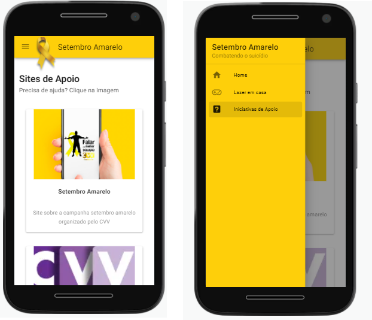

# projeto-hacktoniteris

## Introdução
A página Setembro Amarelo foi criada com o intuito de ajudar a resolver o problema do suicídio, que obviamente é um problema que não se limita apenas ao mês de setembro. A nossa aplicação é um modo de conscientizar as pessoas sobre o assunto, apresentando métodos de prevenção e combate ao suicídio, especialmente no período de pandemia. O nosso principal diferencial é a busca por algo que esteja mais próximo do usuário, como games e animes para ajudar a passar tempo de qualidade, e também incentiva a busca de ajuda profissional nos casos mais sérios.

## Wireframe da aplicação

https://www.figma.com/file/ynd7DaEzFnvMLx4FCcDR7W/Untitled?node-id=0%3A1
## Project setup
```
npm install
```

### Compiles and hot-reloads for development
```
npm run serve
```

### Compiles and minifies for production
```
npm run build
```

### Lints and fixes files
```
npm run lint
```

### Customize configuration
See [Configuration Reference](https://cli.vuejs.org/config/).

# Feito carinhosamente por:

[Natã Menezes](https://www.linkedin.com/in/natanmenezes31/)
[Renan Gonzales](https://www.linkedin.com/in/rgonzalesr/)
[Jordan Elizeu](https://www.linkedin.com/in/jordan-elizeu-2a885a210)